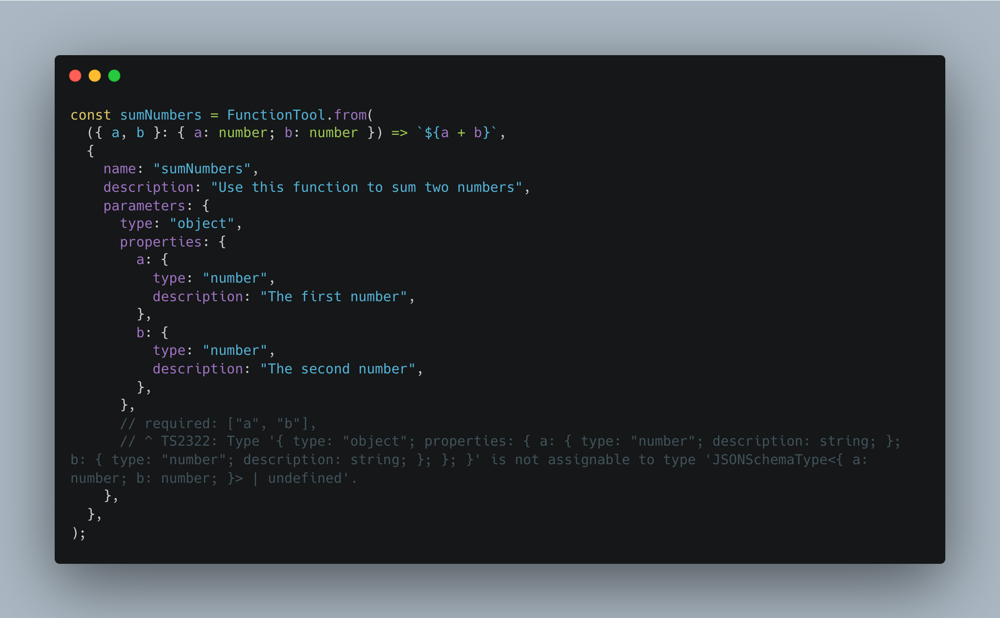

- [What's new in LlamaIndexTS v0.3.0](#whats-new-in-llamaindexts-v030)
- [Improvement in LlamaIndexTS v0.3.0](#improvement-in-llamaindexts-v030)
- [What's the next?](#whats-the-next)

## What's new in LlamaIndexTS v0.3.0

## Agents

In this release, we've not only ported the Agent module from the LlamaIndex Python version but have significantly
enhanced it to be more powerful and user-friendly for JavaScript/TypeScript applications.

Starting from v0.3.0, we are introducing multiple agents specifically designed for RAG applications, including:

- `OpenAIAgent`
- `AnthropicAgent`
- `ReActAgent`:

```ts
import { OpenAIAgent } from "llamaindex";
import { tools } from "./tools";

const agent = new OpenAIAgent({
  tools: [...tools],
});
const { response } = await agent.chat({
  message: "What is weather today?",
  stream: false,
});

console.log(response.message.content);
```

We are also introducing the abstract AgentRunner class, which allows you to create your own agent by simply implementing
the task handler.

```ts
import { AgentRunner, OpenAI } from "llamaindex";

class MyLLM extends OpenAI {}

export class MyAgentWorker extends AgentWorker<MyLLM> {
  taskHandler = MyAgent.taskHandler;
}

export class MyAgent extends AgentRunner<MyLLM> {
  constructor(params: Params) {
    super({
      llm: params.llm,
      chatHistory: params.chatHistory ?? [],
      systemPrompt: params.systemPrompt ?? null,
      runner: new MyAgentWorker(),
      tools:
        "tools" in params
          ? params.tools
          : params.toolRetriever.retrieve.bind(params.toolRetriever),
    });
  }

  // create store is a function to create a store for each task, by default it only includes `messages` and `toolOutputs`
  createStore = AgentRunner.defaultCreateStore;

  static taskHandler: TaskHandler<Anthropic> = async (step, enqueueOutput) => {
    const { llm, stream } = step.context;
    // initialize the input
    const response = await llm.chat({
      stream,
      messages: step.context.store.messages,
    });
    // store the response for next task step
    step.context.store.messages = [
      ...step.context.store.messages,
      response.message,
    ];
    // your logic here to decide whether to continue the task
    const shouldContinue = Math.random(); /* <-- replace with your logic here */
    enqueueOutput({
      taskStep: step,
      output: response,
      isLast: !shouldContinue,
    });
    if (shouldContinue) {
      const content = await someHeavyFunctionCall();
      // if you want to continue the task, you can insert your new context for the next task step
      step.context.store.messages = [
        ...step.context.store.messages,
        {
          content,
          role: "user",
        },
      ];
    }
  };
}
```

### Web Stream API for Streaming response

Web Stream is a web standard utilized in many modern web frameworks and libraries (like React 19, Deno, Node 22). We
have migrated streaming responses to Web Stream to ensure broader compatibility.

For instance, you can use the streaming response in a simple HTTP Server:

```ts
import { createServer } from "http";
import { OpenAIAgent } from "llamaindex";
import { OpenAIStream, streamToResponse } from "ai";
import { tools } from "./tools";

const agent = new OpenAIAgent({
  tools: [...tools],
});

const server = createServer(async (req, res) => {
  const response = await agent.chat({
    message: "What is weather today?",
    stream: true,
  });

  // Transform the response into a string readable stream
  const stream: ReadableStream<string> = response.pipeThrough(
    new TransformStream({
      transform: (chunk, controller) => {
        controller.enqueue(chunk.response.delta);
      },
    }),
  );

  // Pipe the stream to the response
  streamToResponse(stream, res);
});

server.listen(3000);
```

Or it can be integrated into React Server Components (RSC) in Next.js:

```tsx
// app/actions/index.tsx
"use server";
import { createStreamableUI } from "ai/rsc";
import { OpenAIAgent } from "llamaindex";
import type { ChatMessage } from "llamaindex/llm/types";

export async function chatWithAgent(
  question: string,
  prevMessages: ChatMessage[] = [],
) {
  const agent = new OpenAIAgent({
    tools: [],
  });
  const responseStream = await agent.chat({
    stream: true,
    message: question,
    chatHistory: prevMessages,
  });
  const uiStream = createStreamableUI(<div>loading...</div>);
  responseStream
    .pipeTo(
      new WritableStream({
        start: () => {
          uiStream.update("response:");
        },
        write: async (message) => {
          uiStream.append(message.response.delta);
        },
      }),
    )
    .catch(uiStream.error);
  return uiStream.value;
}
```

```tsx
// app/src/page.tsx
"use client";
import { chatWithAgent } from "@/actions";
import type { JSX } from "react";
import { useFormState } from "react-dom";

export const runtime = "edge";

export default function Home() {
  const [state, action] = useFormState<JSX.Element | null>(async () => {
    return chatWithAgent("hello!", []);
  }, null);
  return (
    <main>
      {state}
      <form action={action}>
        <button>Chat</button>
      </form>
    </main>
  );
}
```

## Improvement in LlamaIndexTS v0.3.0

### Better TypeScript support

We have made significant improvements to the type system to ensure that all code is thoroughly checked before it is
published. This ongoing enhancement has already resulted in better module reliability and developer experience.

For example, we have improved `FunctionTool` type with generic support:

```ts
type Input = {
  a: number;
  b: number;
};

const sumNumbers = FunctionTool.from<Input>(
  ({ a, b }) => `${a + b}`, // a and b will be checked as number
  // JSON schema will be an error if you type wrong.
  {
    name: "sumNumbers",
    description: "Use this function to sum two numbers",
    parameters: {
      type: "object",
      properties: {
        a: {
          type: "number",
          description: "The first number",
        },
        b: {
          type: "number",
          description: "The second number",
        },
      },
      required: ["a", "b"],
    },
  },
);
```



### Better Next.js, Deno, Cloudflare Worker, and Waku(Vite) support

In addition to Node.js, LlamaIndexTS now offers enhanced support for Next.js, Deno, and Cloudflare Workers, making it
more versatile across different platforms.

For now, you can install llamaindex and directly import it into your existing Next.js, Deno or Cloudflare Worker project
**without any extra configuration**.

#### [Deno](https://deno.com/)

You can use LlamaIndexTS in Deno by installation through JSR:

```sh
jsr add @llamaindex/core
```

#### [Cloudflare Worker](https://developers.cloudflare.com/workers/)

For Cloudflare Workers, here is a starter template:

```typescript
export default {
  async fetch(
    request: Request,
    env: Env,
    ctx: ExecutionContext,
  ): Promise<Response> {
    const { setEnvs } = await import("@llamaindex/env");
    setEnvs(env);
    const { OpenAIAgent } = await import("llamaindex");
    const agent = new OpenAIAgent({
      tools: [],
    });
    const responseStream = await agent.chat({
      stream: true,
      message: "Hello? What is the weather today?",
    });
    const textEncoder = new TextEncoder();
    const response = responseStream.pipeThrough(
      new TransformStream({
        transform: (chunk, controller) => {
          controller.enqueue(textEncoder.encode(chunk.response.delta));
        },
      }),
    );
    return new Response(response);
  },
};
```

### [Waku (Vite)](https://waku.gg/)

Waku powered by Vite is a minimal React framework that supports multiple JS environments, including Deno, Cloudflare, and
Node.js.

You can use LlamaIndexTS with Node.js output to enable full Node.js support with React.

```sh
npm install llamaindex
```

```ts
// file: src/actions.ts
"use server";
import { Document, VectorStoreIndex } from "llamaindex";
import { readFile } from "node:fs/promises";

const path = "node_modules/llamaindex/examples/abramov.txt";

const essay = await readFile(path, "utf-8");

// Create Document object with essay
const document = new Document({ text: essay, id_: path });

// Split text and create embeddings. Store them in a VectorStoreIndex
const index = await VectorStoreIndex.fromDocuments([document]);

const queryEngine = index.asQueryEngine();

export async function chatWithAI(question: string): Promise<string> {
  const { response } = await queryEngine.query({ query: question });
  return response;
}
```

```tsx
// file: src/pages/index.tsx
import { chatWithAI } from "./actions";

export default async function HomePage() {
  return (
    <div>
      <Chat askQuestion={chatWithAI} />
    </div>
  );
}
```

```tsx
// file: src/components/Chat.tsx
"use client";

export type ChatProps = {
  askQuestion: (question: string) => Promise<string>;
};

export const Chat = (props: ChatProps) => {
  const [response, setResponse] = useState<string | null>(null);

  return (
    <section className="border-blue-400 -mx-4 mt-4 rounded border border-dashed p-4">
      <h2 className="text-lg font-bold">Chat with AI</h2>
      {response ? (
        <p className="text-sm text-gray-600 max-w-sm">{response}</p>
      ) : null}
      <form
        action={async (formData) => {
          const question = formData.get("question") as string | null;
          if (question) {
            setResponse(await props.askQuestion(question));
          }
        }}
      >
        <input
          type="text"
          name="question"
          className="border border-gray-400 rounded-sm px-2 py-0.5 text-sm"
        />
        <button className="rounded-sm bg-black px-2 py-0.5 text-sm text-white">
          Ask
        </button>
      </form>
    </section>
  );
};
```

```shell
waku dev # development mode
waku build # build for production
waku start # start the production server
```

Note that not all the modules are supported in all JS environments because of
lack of the file system, network API,
and incompatibility with the Node.js API by upstream dependencies.

But we are trying to make it more compatible with all the environments.

## What's the next?

As we continue to develop LlamaIndexTS, our focus remains on providing more comprehensive and powerful tools for
creating custom agents.

### Align with the Python `llama-index`

We aim to align LlamaIndexTS with the Python version to ensure API consistency and ease of use for developers familiar
with the Python ecosystem.

### Align with the Web Standard and JS development

Not all python APIs are compatible and easy to use in JavaScript/TypeScript.
We are trying to make the API more compatible with the Web Standard and JavaScript modern development.

### More Agents

Future releases will introduce more agents from the Python Llama-Index and explore APIs tailored to real-world use
cases.

### 🧪 `@llamaindex/tool`

We are exploring innovative ways to create tools for agents. The `@llamaindex/tool` library allows you to transform any
function into a tool for an agent, simplifying the development process and reducing runtime costs.

```ts
export function getWeather(city: string) {
  return `The weather in ${city} is sunny.`;
}

// you don't need to worry about the shcema with different llm tools
export function getTemperature(city: string) {
  return `The temperature in ${city} is 25°C.`;
}

export function getCurrentCity() {
  return "New York";
}
```

These functions can be easily integrated into your applications, such as Next.js:

```ts
"use server";
import { OpenAI } from "openai";
import { getTools } from "@llamaindex/tool";

export async function chat(message: string) {
  const openai = new OpenAI();
  openai.chat.completions.create({
    messages: [
      {
        role: "user",
        content: "What is the weather in the current city?",
      },
    ],
    tools: getTools("openai"),
  });
}
```

```ts
// next.config.js
const withTool = require("@llamaindex/tool/next");

const config = {
  // Your original Next.js config
};
module.exports = withTool(config);
```

The functions are automatically transformed into tools for the agent at compile time, which eliminates any extra runtime
costs. This feature is particularly beneficial when you need to debug or deploy your assistant.

For deploying your local functions into OpenAI, you can use a simple command:

```sh
npm install -g @llamaindex/tool
mkai --tools ./src/index.llama.ts
# Successfully created assistant: asst_XXX
# chat with your assistant by `chatai --assistant asst_XXX`
chatai --assistant asst_XXX
# Open your browser and chat with your assistant
# Running at http://localhost:3000
```

This deployment process simplifies the testing and implementation of your custom tools in a live environment.

As this project is still in its early stages, we continue to explore the best ways to create and integrate tools for
agents. For more information and updates, visit the @llamaindex/tool repository.

This release of LlamaIndexTS v0.3.0 marks a significant step forward in our journey to provide developers with robust,
flexible tools for building advanced agents. We are excited to see how our community utilizes these new capabilities to
create innovative solutions and look forward to continuing to support and enhance LlamaIndexTS in future updates.
