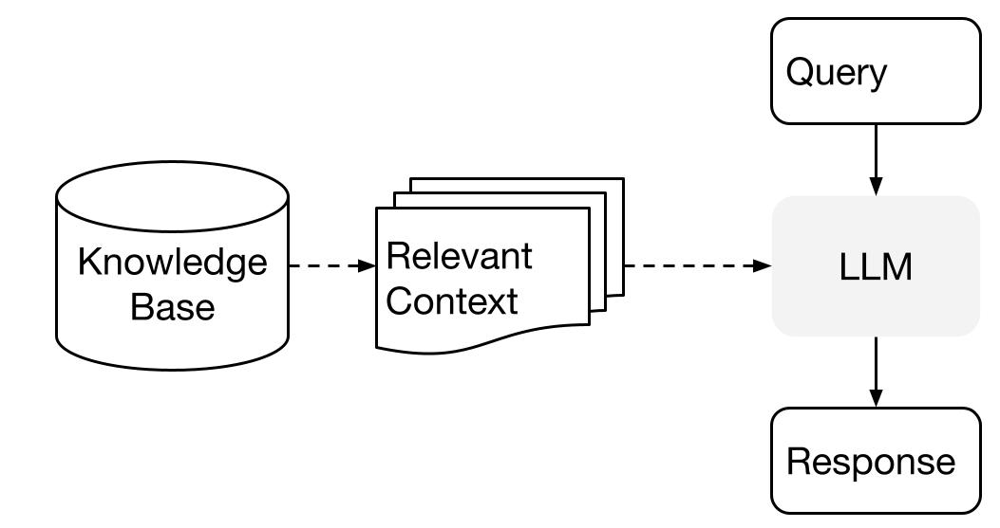
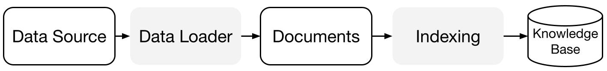
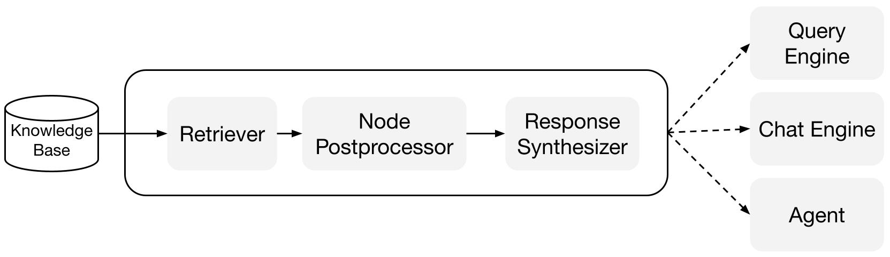

# Concepts de haut niveau

LlamaIndex.TS vous aide à construire des applications alimentées par LLM (par exemple, Q&R, chatbot) sur des données personnalisées.

Dans ce guide des concepts de haut niveau, vous apprendrez :

- comment un LLM peut répondre aux questions en utilisant vos propres données.
- les concepts clés et les modules de LlamaIndex.TS pour composer votre propre pipeline de requête.

## Répondre aux questions sur vos données

LlamaIndex utilise une méthode en deux étapes lors de l'utilisation d'un LLM avec vos données :

1. **étape d'indexation** : préparation d'une base de connaissances, et
2. **étape de requête** : récupération du contexte pertinent à partir des connaissances pour aider le LLM à répondre à une question.

Ce processus est également connu sous le nom de génération augmentée par récupération (RAG).

LlamaIndex.TS fournit l'ensemble d'outils essentiel pour rendre ces deux étapes très faciles.

Explorons chaque étape en détail.

### Étape d'indexation

LlamaIndex.TS vous aide à préparer la base de connaissances avec une suite de connecteurs de données et d'index.

[**Chargeurs de données**](./modules/high_level/data_loader):
Un connecteur de données (c'est-à-dire un `Reader`) ingère des données à partir de différentes sources de données et de formats de données dans une représentation simple de `Document` (texte et métadonnées simples).

[**Documents / Noeuds**](./modules/high_level/documents_and_nodes): Un `Document` est un conteneur générique pour n'importe quelle source de données - par exemple, un PDF, une sortie d'API, ou des données récupérées à partir d'une base de données. Un `Noeud` est l'unité atomique de données dans LlamaIndex et représente un "morceau" d'un `Document` source. C'est une représentation riche qui inclut des métadonnées et des relations (avec d'autres noeuds) pour permettre des opérations de récupération précises et expressives.

[**Index de données**](./modules/high_level/data_index):
Une fois que vous avez ingéré vos données, LlamaIndex vous aide à indexer les données dans un format facile à récupérer.

Sous le capot, LlamaIndex analyse les documents bruts en représentations intermédiaires, calcule des plongements vectoriels, et stocke vos données en mémoire ou sur disque.

### Étape de requête

Dans l'étape de requête, le pipeline de requête récupère le contexte le plus pertinent en fonction d'une requête utilisateur,
et le transmet au LLM (avec la requête) pour synthétiser une réponse.

Cela donne au LLM des connaissances à jour qui ne sont pas dans ses données d'entraînement d'origine
(réduisant également l'hallucination).

Le défi clé à l'étape de requête est la récupération, l'orchestration et le raisonnement sur (potentiellement de nombreuses) bases de connaissances.

LlamaIndex fournit des modules composables qui vous aident à construire et intégrer des pipelines RAG pour Q&R (moteur de requête), chatbot (moteur de chat), ou en tant que partie d'un agent.

Ces blocs de construction peuvent être personnalisés pour refléter les préférences de classement, ainsi que composés pour raisonner sur plusieurs bases de connaissances de manière structurée.

#### Blocs de construction

[**Récupérateurs**](./modules/low_level/retriever) :
Un récupérateur définit comment récupérer efficacement le contexte pertinent à partir d'une base de connaissances (c'est-à-dire un index) lorsqu'une requête est donnée.
La logique de récupération spécifique diffère pour différents indices, la plus populaire étant la récupération dense contre un index vectoriel.

[**Synthétiseurs de réponse**](./modules/low_level/response_synthesizer) :
Un synthétiseur de réponse génère une réponse à partir d'un LLM, en utilisant une requête utilisateur et un ensemble donné de fragments de texte récupérés.

#### Pipelines

[**Moteurs de requête**](./modules/high_level/query_engine):
Un moteur de requête est un pipeline de bout en bout qui vous permet de poser des questions sur vos données.
Il prend une requête en langage naturel et renvoie une réponse, ainsi que le contexte de référence récupéré et transmis au LLM.

[**Moteurs de chat**](./modules/high_level/chat_engine):
Un moteur de chat est un pipeline de bout en bout pour avoir une conversation avec vos données
(plusieurs allers-retours au lieu d'une seule question-réponse).
