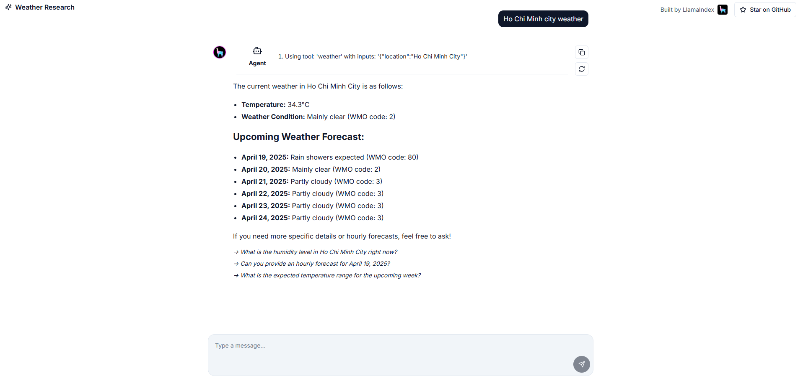

# Run LlamaIndex Server with simple steps

1. Setup environment variables

```bash
export OPENAI_API_KEY=<your-openai-api-key>
```

2. Run the server

```bash
npx tsx llamaindex-server/simple-workflow/index.ts
```

3. Open the app at `http://localhost:4000` and start chatting with the agent


